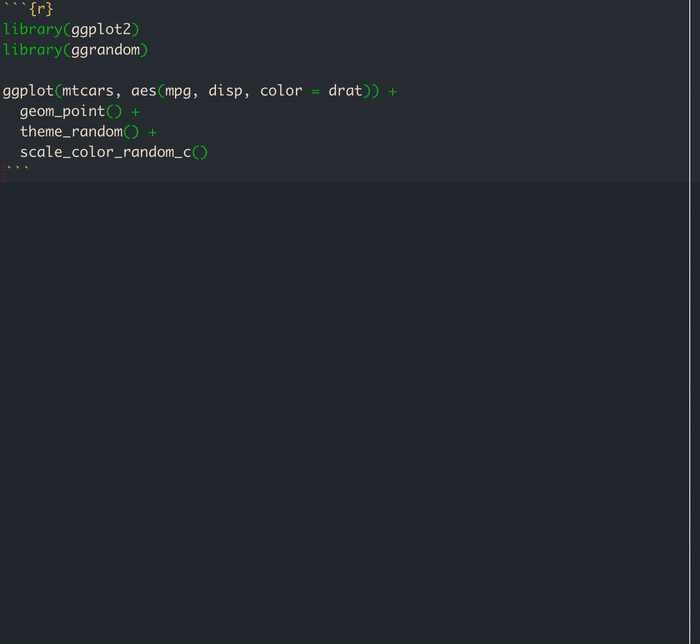

<!-- README.md is generated from README.Rmd. Please edit that file -->

```{r, include = FALSE}
knitr::opts_chunk$set(
  collapse = TRUE,
  comment = "#>",
  fig.path = "man/figures/README-",
  out.width = "100%"
)
```

# ggrandom

<!-- badges: start -->
[](https://github.com/EmilHvitfeldt/ggrandom/actions)
<!-- badges: end -->

The goal of ggrandom is to introduce CHAOS to ggplot2 by adding random themes and colors palettes.

## Installation

Install the development version from GitHub with:

``` r
require("devtools")
install_github("emilhvitfeldt/ggrandom")
```

## Example

use `theme_random()` to add a random theme. Setting `chaos = TRUE` lets `theme_random()` "ignore" the seed.

```{r}
library(ggplot2)
library(ggrandom)

ggplot(mtcars, aes(mpg, disp)) +
  geom_point() +
  theme_random()

set.seed(1234)
ggplot(mtcars, aes(mpg, disp)) +
  geom_point() +
  theme_random(chaos = TRUE)
```

## Example (gif)


