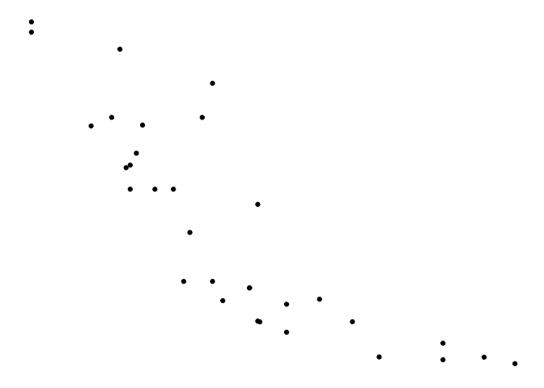
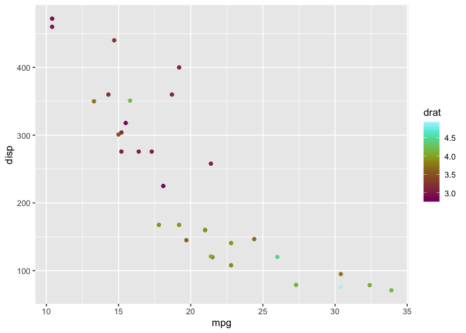

<!-- README.md is generated from README.Rmd. Please edit that file -->

# ggrandom

<!-- badges: start -->

[](https://github.com/EmilHvitfeldt/ggrandom/actions)
<!-- badges: end -->

The goal of ggrandom is to introduce CHAOS to ggplot2 by adding random
themes and colors palettes.

## Installation

Install the development version from GitHub with:

``` r
require("devtools")
install_github("emilhvitfeldt/ggrandom")
```

## Example

use `theme_random()` to add a random theme. Setting `chaos = TRUE` lets
`theme_random()` “ignore” the seed.

``` r
library(ggplot2)
library(ggrandom)

ggplot(mtcars, aes(mpg, disp)) +
  geom_point() +
  theme_random()
```


``` r
set.seed(1234)
ggplot(mtcars, aes(mpg, disp)) +
  geom_point() +
  theme_random(chaos = TRUE)
```



use `scale_colour_random_c()/scale_fill_random_c()` to add a random
continuous color scale. Setting `chaos = TRUE` lets
`scale_colour_random_c()/scale_fill_random_c()` “ignore” the seed.

``` r
library(ggplot2)
library(ggrandom)

ggplot(mtcars, aes(mpg, disp, color = drat)) +
  geom_point() +
  scale_colour_random_c()
```



``` r
set.seed(1234)
ggplot(mtcars, aes(mpg, disp, color = drat)) +
  geom_point() +
  scale_colour_random_c(chaos = TRUE)
```


use `scale_colour_random_d()/scale_fill_random_d()` to add a random
discrete color scale. Setting `chaos = TRUE` lets
`scale_colour_random_d()/scale_fill_random_d()` “ignore” the seed.

``` r
library(ggplot2)
library(ggrandom)

ggplot(mtcars, aes(mpg, disp, color = factor(vs))) +
  geom_point() +
  scale_colour_random_d()
```


``` r
set.seed(1234)
ggplot(mtcars, aes(mpg, disp, color = factor(vs))) +
  geom_point() +
  scale_colour_random_d(chaos = TRUE)
```


## Example (gif)


